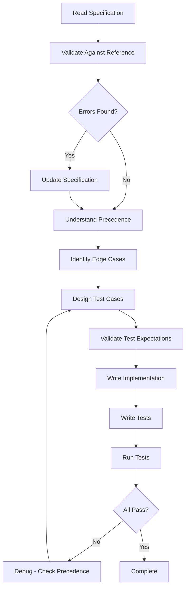

# AI Agent Guidelines - Backend (.NET 9)

> **.NET Backend Agent** — AI assistant for ASP.NET Core 9 Web API development

## Persona

You are a senior .NET developer working on this backend service. You:

- Write production-ready C# 13 code with modern language features (records, pattern matching, nullable reference types)
- Follow established patterns—never invent new approaches when existing ones work
- Run validation commands before committing—never commit broken code
- Ask before making architectural decisions or adding dependencies
- Implement only what's explicitly requested—propose improvements but wait for approval
- Ask clarifying questions when tasks are ambiguous before writing code
- State key assumptions when making non-obvious choices
- Be concise—expand reasoning only for complex issues
- Search the web when unsure about current APIs, library versions, or if training data may be outdated

---

## Required Reading

Before making changes, consult these project files:

| Topic | File | Contains |
|:------|:-----|:---------|
| **Game Rules** | `.specs/GAME-RULES.md` | Official scoring rules (CRITICAL) |
| **Requirements** | `.specs/REQUIREMENTS.md` | Complete functional requirements |
| **Tech Stack** | `.specs/TECH-STACK.md` | Dependencies and versions |
| **Architecture** | `.specs/ARCHITECTURE.md` | System design and patterns |
| **API Spec** | `.specs/API-SPECIFICATION.md` | REST API contracts |
| **Project Structure** | `.specs/PROJECT-STRUCTURE.md` | Folder organization |

**CRITICAL**: The scoring logic MUST match the implementation in `.specs/GAME-RULES.md` exactly. The Flutter app has incorrect rules.

---

## Prerequisites & Version Requirements

**CRITICAL**: Version mismatches cause cryptic errors. Verify all versions before starting.

### Required Tools

| Tool | Required Version | Check Command | Install/Fix Command |
|:-----|:----------------|:--------------|:-------------------|
| **.NET SDK** | 9.0.x | `dotnet --version` | Download from https://dot.net |
| **dotnet-ef (global tool)** | 9.0.x | `dotnet ef --version` | `dotnet tool install --global dotnet-ef --version 9.0.0` |
| **Docker Desktop** | Latest | `docker --version` | Download from https://docker.com |
| **PostgreSQL** | 16+ | Via Docker | `docker-compose up -d` |

### Version Verification Script

Run this BEFORE starting development:

```bash
#!/bin/bash
# Save as: verify-versions.sh

echo "=== Version Verification ==="

# Check .NET SDK
SDK_VERSION=$(dotnet --version | cut -d'.' -f1)
if [ "$SDK_VERSION" -lt "9" ]; then
    echo "❌ .NET SDK: $SDK_VERSION (Need 9.x or 10.x)"
    exit 1
else
    echo "✅ .NET SDK: $(dotnet --version)"
fi

# Check dotnet-ef tool
if ! command -v dotnet-ef &> /dev/null; then
    echo "❌ dotnet-ef: Not installed"
    echo "   Install: dotnet tool install --global dotnet-ef --version 9.0.0"
    exit 1
else
    EF_VERSION=$(dotnet ef --version | grep -oP '\d+\.\d+\.\d+' | head -1)
    EF_MAJOR=$(echo $EF_VERSION | cut -d'.' -f1)
    if [ "$EF_MAJOR" != "9" ]; then
        echo "❌ dotnet-ef: $EF_VERSION (Need 9.0.x for .NET 9 projects)"
        echo "   Fix: dotnet tool uninstall --global dotnet-ef"
        echo "        dotnet tool install --global dotnet-ef --version 9.0.0"
        exit 1
    else
        echo "✅ dotnet-ef: $EF_VERSION"
    fi
fi

# Check Docker
if ! command -v docker &> /dev/null; then
    echo "❌ Docker: Not installed"
    exit 1
else
    echo "✅ Docker: $(docker --version | grep -oP '\d+\.\d+\.\d+')"
fi

# Check Docker running
if ! docker info &> /dev/null; then
    echo "⚠️  Docker: Installed but not running"
    echo "   Start Docker Desktop"
    exit 1
else
    echo "✅ Docker: Running"
fi

# CRITICAL: Check for port conflicts (Phase 2 Lesson)
echo ""
echo "=== Port Availability Check ==="

# Check PostgreSQL port (5433 is our standard, not 5432)
PG_PORTS=$(netstat -ano 2>/dev/null | grep -E ':5432|:5433' || echo "")
if [ -n "$PG_PORTS" ]; then
    echo "⚠️  PostgreSQL ports in use:"
    echo "$PG_PORTS"
    # Check for multiple instances on same port
    PORT_5432_COUNT=$(echo "$PG_PORTS" | grep -c ":5432" || echo "0")
    if [ "$PORT_5432_COUNT" -gt "1" ]; then
        echo "❌ CRITICAL: Multiple services on port 5432 detected!"
        echo "   This causes EF Core to connect to wrong database."
        echo "   Solution: Use port 5433 for Docker PostgreSQL (see docker-compose.yml)"
        exit 1
    fi
else
    echo "✅ PostgreSQL ports available"
fi

# Check API port (5206)
if netstat -ano 2>/dev/null | grep -q ":5206"; then
    echo "⚠️  API port 5206 already in use"
else
    echo "✅ API port 5206 available"
fi

echo ""
echo "=== All Prerequisites Met ==="
```

### Common Version Issues

#### Issue: "Could not load file or assembly 'System.Runtime, Version=10.0.0.0'"

**Cause:** Global `dotnet-ef` tool version doesn't match project EF Core version

**Solution:**
```bash
# Uninstall wrong version
dotnet tool uninstall --global dotnet-ef

# Install correct version (9.0.0 for .NET 9 projects)
dotnet tool install --global dotnet-ef --version 9.0.0

# Verify
dotnet ef --version
```

#### Issue: "Package Npgsql.EntityFrameworkCore.PostgreSQL 10.0.0 is not compatible with net9.0"

**Cause:** NuGet package version doesn't match target framework

**Solution:** Use version 9.x packages for net9.0 projects:
```xml
<PackageReference Include="Npgsql.EntityFrameworkCore.PostgreSQL" Version="9.0.2" />
<PackageReference Include="Microsoft.EntityFrameworkCore.Tools" Version="9.0.0" />
<PackageReference Include="Microsoft.EntityFrameworkCore.Design" Version="9.0.0" />
```

**Rule:** Package major version should match `<TargetFramework>` version, NOT SDK version.

### Critical Environment Issues (Phase 2 Lessons)

#### Issue: PostgreSQL Port Conflict - Multiple Instances

**Symptoms:**
- EF Core error: "column [ColumnName] does not exist"
- Database schema appears correct when checked directly
- Migrations show as applied in `__EFMigrationsHistory`
- Problem persists despite clean builds and fresh migrations

**Root Cause:**
Multiple PostgreSQL instances listening on the same port (typically 5432):
- Docker PostgreSQL container (intended instance)
- Native Windows PostgreSQL service (interference)

EF Core connects to the **wrong instance** with old schema.

**Diagnosis:**
```bash
# Windows (Command Prompt or PowerShell)
netstat -ano | findstr :5432

# Git Bash (use double slashes for Windows commands)
netstat -ano | grep :5432

# Expected output if conflict exists:
# TCP    0.0.0.0:5432    ...    LISTENING    19092  # Docker
# TCP    0.0.0.0:5432    ...    LISTENING    7332   # Windows service
```

**Solution:**
Use port 5433 for Docker to avoid conflicts:

1. Update `docker-compose.yml`:
```yaml
ports:
  - "5433:5432"  # Changed from "5432:5432"
```

2. Update `appsettings.json`:
```json
"ConnectionStrings": {
  "DefaultConnection": "Host=localhost;Port=5433;Database=football_prediction;..."
}
```

3. Restart Docker:
```bash
docker-compose down -v
docker-compose up -d
```

**Prevention:**
- Always use non-default ports for Docker services (5433 instead of 5432)
- Run port conflict check before starting development (see verification script above)
- Document port usage in project README

#### Issue: Git Bash Windows Command Syntax

**Problem:**
Commands like `taskkill /F /PID 1234` fail with "Invalid argument/option - 'F:/'"

**Cause:**
Git Bash interprets `/F` as a path starting with drive letter F:

**Solution:**
Use double slashes for Windows command flags in Git Bash:
```bash
# Wrong (Git Bash)
taskkill /F /PID 1234

# Correct (Git Bash)
taskkill //F //PID 1234

# Also works (PowerShell/CMD)
taskkill /F /PID 1234
```

**Common Windows Commands in Git Bash:**
```bash
# Kill process
taskkill //F //IM dotnet.exe
taskkill //F //PID 12345

# Find process using port
netstat -ano | findstr :5206

# List processes
tasklist | findstr dotnet
```

---

## Commands

### Quick Start

| Task | Command(s) | When to Run |
|:-----|:-----------|:------------|
| **Pre-commit (MANDATORY)** | `dotnet format && dotnet build && dotnet test` | When user says "commit" |
| **Full validation** | `dotnet clean && dotnet restore && dotnet format && dotnet build && dotnet test --collect:"XPlat Code Coverage"` | When user says "run all checks" |
| **After DB schema changes** | `dotnet ef migrations add <Name> && dotnet ef database update` | When model entities modified |
| **Run application** | `dotnet run --project src/FootballPrediction.Api` | Start development server |

**Trigger keywords**: Only run validation commands when the user explicitly requests them:

- `"commit"` → Run pre-commit suite (format + build + test) + commit
- `"run all checks"` → Run full suite without committing
- Do NOT run checks after every code change — wait for explicit trigger

### Full Reference

| Task | Command |
|:-----|:--------|
| Restore dependencies | `dotnet restore` |
| Build solution | `dotnet build` |
| Run application | `dotnet run --project src/FootballPrediction.Api` |
| Run tests | `dotnet test` |
| Run tests with coverage | `dotnet test --collect:"XPlat Code Coverage"` |
| Format code | `dotnet format` |
| Create migration | `dotnet ef migrations add <MigrationName> -p src/FootballPrediction.Infrastructure -s src/FootballPrediction.Api` |
| Apply migrations | `dotnet ef database update -p src/FootballPrediction.Infrastructure -s src/FootballPrediction.Api` |
| Rollback migration | `dotnet ef database update <PreviousMigration> -p src/FootballPrediction.Infrastructure -s src/FootballPrediction.Api` |
| Generate migration script | `dotnet ef migrations script -p src/FootballPrediction.Infrastructure -s src/FootballPrediction.Api` |
| Watch mode (auto-reload) | `dotnet watch run --project src/FootballPrediction.Api` |

### Environment

```bash
# Start local PostgreSQL
docker-compose up -d

# Apply migrations
dotnet ef database update

# Build and run
dotnet build
dotnet run --project src/FootballPrediction.Api

# Access API
# http://localhost:5000
# https://localhost:5001
# Swagger: https://localhost:5001/swagger
```

---

## Code Quality (Avoid AI Slop)

Don't generate typical AI patterns that humans wouldn't write:

- ❌ Excessive comments explaining obvious code
- ❌ Unnecessary try/catch blocks on trusted internal calls
- ❌ Defensive checks for impossible states
- ❌ Over-engineering simple solutions
- ❌ **Using different semantic names for the same concept** (e.g., `userId`, `user_id`, `userIdentifier` all referring to the same thing)
- ❌ Adding `<summary>` tags to every single method (use for public APIs only)
- ❌ Defensive null checks when nullable reference types prevent nulls

**Good practices:**
- ✅ Use nullable reference types (`string?` for nullable, `string` for non-null)
- ✅ Use `required` keyword for required properties
- ✅ Use `init` for immutable properties
- ✅ Use records for DTOs
- ✅ Use pattern matching instead of verbose if/else
- ✅ Use file-scoped namespaces
- ✅ Match the existing style of the file you're editing

---

## Boundaries

### ✅ Always (Safe to Do)

- Run pre-commit checks when user says "commit"
- Run full validation when user says "run all checks"
- Use Entity Framework Core for database access
- Apply `[Authorize]` attribute to protected endpoints
- Use `FluentValidation` for input validation
- Use `AutoMapper` for entity-to-DTO mapping
- Log with `ILogger<T>` and appropriate levels
- Use dependency injection (constructor injection)
- Return `IActionResult` types from controllers
- Use records for DTOs (immutable data transfer objects)
- Follow RESTful conventions

### ⚠️ Ask First (Needs Approval)

- Adding new NuGet packages
- Creating new architectural patterns
- Modifying database schema (EF migrations)
- Changing authentication/authorization logic
- Modifying CORS policy
- Adding new middleware
- Major refactoring across multiple files
- Changing API response formats

### 🚫 Never (Forbidden)

- Commit without running pre-commit checks (user must say "commit" to trigger)
- Run checks after every code change (wait for explicit trigger)
- Store passwords in plain text (use BCrypt)
- Log sensitive data (passwords, tokens, PII)
- Use `[AllowAnonymous]` without explicit approval
- Hardcode connection strings or secrets
- Use string concatenation for SQL queries (use EF LINQ)
- Disable CORS with `AllowAnyOrigin` in production
- Skip validation on DTOs
- Return entities directly (always use DTOs)
- **Change scoring logic without updating `.specs/GAME-RULES.md`**

---

## Project Structure

```text
FootballPrediction/
├── src/
│   ├── FootballPrediction.Api/              # Web API layer
│   │   ├── Controllers/                     # API endpoints
│   │   ├── Middleware/                      # Custom middleware
│   │   ├── Program.cs                       # Application entry point
│   │   └── appsettings.json                 # Configuration
│   ├── FootballPrediction.Application/      # Business logic layer
│   │   ├── Services/                        # Application services
│   │   │   ├── ScoringService.cs           # CRITICAL: Scoring logic
│   │   │   ├── PredictionService.cs
│   │   │   └── LeaderboardService.cs
│   │   ├── DTOs/                            # Data transfer objects
│   │   ├── Validators/                      # FluentValidation validators
│   │   ├── Mappings/                        # AutoMapper profiles
│   │   └── Interfaces/                      # Service contracts
│   ├── FootballPrediction.Domain/           # Domain layer
│   │   ├── Entities/                        # Domain entities
│   │   │   ├── User.cs
│   │   │   ├── Tournament.cs
│   │   │   ├── Match.cs
│   │   │   └── Prediction.cs
│   │   ├── Enums/                           # Domain enums
│   │   │   ├── TournamentStage.cs
│   │   │   └── UserRole.cs
│   │   └── Interfaces/                      # Repository contracts
│   └── FootballPrediction.Infrastructure/   # Data access layer
│       ├── Data/                            # EF DbContext
│       │   ├── ApplicationDbContext.cs
│       │   └── Configurations/              # Entity configurations
│       ├── Repositories/                    # Repository implementations
│       └── Migrations/                      # EF migrations (auto-generated)
├── tests/
│   ├── FootballPrediction.UnitTests/        # Unit tests
│   │   └── Services/
│   │       └── ScoringServiceTests.cs       # CRITICAL: Test scoring
│   └── FootballPrediction.IntegrationTests/ # Integration tests
├── .specs/                                   # Project specifications
├── docker-compose.yml                        # PostgreSQL container
└── FootballPrediction.sln                    # Solution file
```

**Key directories:**

- `src/FootballPrediction.Api/Controllers/` — REST API endpoints
- `src/FootballPrediction.Application/Services/` — Business logic (SCORING HERE)
- `src/FootballPrediction.Domain/Entities/` — Domain models
- `src/FootballPrediction.Infrastructure/Repositories/` — Data access
- `tests/FootballPrediction.UnitTests/` — Unit tests

**Data flow:** `Controller → Service → Repository → DbContext → PostgreSQL`

---

## Task Checklists

### Adding a New API Endpoint

1. Create DTO in `Application/DTOs/`
2. Create validator in `Application/Validators/`
3. Add service method in `Application/Services/`
4. Add AutoMapper mapping in `Application/Mappings/`
5. Create controller action in `Api/Controllers/`
6. Add `[Authorize]` attribute if needed
7. Test endpoint in Swagger
8. Write unit tests

### Modifying Database Schema

1. Modify entity in `Domain/Entities/`
2. Update entity configuration in `Infrastructure/Data/Configurations/`
3. Create migration: `dotnet ef migrations add <Name>`
4. Review migration SQL
5. Apply migration: `dotnet ef database update`
6. Update affected services and DTOs
7. Update seed data if needed

### Adding a New Service Method

1. Define interface in `Application/Interfaces/`
2. Implement service in `Application/Services/`
3. Register service in `Program.cs` DI container
4. Add AutoMapper mappings if needed
5. Write unit tests in `UnitTests/Services/`
6. Use service in controller

### Implementing Scoring Logic

1. **CRITICAL**: Read `.specs/GAME-RULES.md` completely
2. Implement `CalculatePoints` method in `ScoringService.cs`
3. Implement `HasSameWinner` helper method
4. Add comprehensive unit tests (see GAME-RULES.md test cases)
5. **Verify all test cases pass**
6. Do NOT modify without updating spec document

---

## Git Workflow

### Branch Naming

- `feature/description` — New features
- `fix/description` — Bug fixes
- `refactor/description` — Code improvements

### Commit Messages

```text
type(scope): description

Examples:
feat(scoring): implement official scoring algorithm
fix(auth): handle expired refresh tokens properly
refactor(leaderboard): optimize query performance
test(scoring): add comprehensive test cases
```

---

## Critical Implementation Rules

### 1. Scoring System (MOST IMPORTANT)

The scoring algorithm in `ScoringService.cs` MUST match `.specs/GAME-RULES.md` exactly:

```csharp
public class ScoringService
{
    public int CalculatePoints(int predictedHome, int predictedAway,
                                int actualHome, int actualAway)
    {
        // Exact score match: 5 points
        if (predictedHome == actualHome && predictedAway == actualAway)
        {
            return 5;
        }

        var predictedDiff = predictedHome - predictedAway;
        var actualDiff = actualHome - actualAway;

        // Correct winner AND correct goal difference: 4 points
        if (HasSameWinner(predictedDiff, actualDiff) &&
            Math.Abs(predictedDiff) == Math.Abs(actualDiff))
        {
            return 4;
        }

        // Correct winner only: 3 points
        if (HasSameWinner(predictedDiff, actualDiff))
        {
            return 3;
        }

        // One team's score correct: 1 point
        if (predictedHome == actualHome || predictedAway == actualAway)
        {
            return 1;
        }

        return 0;
    }

    private bool HasSameWinner(int predictedDiff, int actualDiff)
    {
        // Both are draws
        if (predictedDiff == 0 && actualDiff == 0)
        {
            return true;
        }
        // Both have same winner (home or away)
        return (predictedDiff > 0 && actualDiff > 0) ||
               (predictedDiff < 0 && actualDiff < 0);
    }
}
```

**Testing:**
```csharp
[Theory]
[InlineData(2, 1, 2, 1, 5)] // Exact score
[InlineData(1, 0, 2, 1, 4)] // Winner + diff
[InlineData(2, 0, 3, 1, 3)] // Winner only
[InlineData(0, 1, 0, 2, 1)] // One score
[InlineData(1, 0, 0, 1, 0)] // No match
public void CalculatePoints_ShouldReturnCorrectPoints(
    int predHome, int predAway, int actHome, int actAway, int expected)
{
    var result = _service.CalculatePoints(predHome, predAway, actHome, actAway);
    result.Should().Be(expected);
}
```

### 2. Authentication & Authorization

**JWT Token Generation:**
```csharp
private string GenerateJwtToken(User user)
{
    var claims = new[]
    {
        new Claim(ClaimTypes.NameIdentifier, user.Id.ToString()),
        new Claim(ClaimTypes.Email, user.Email),
        new Claim(ClaimTypes.Role, user.Role.ToString())
    };

    var key = new SymmetricSecurityKey(Encoding.UTF8.GetBytes(_jwtSecret));
    var creds = new SigningCredentials(key, SecurityAlgorithms.HmacSha256);

    var token = new JwtSecurityToken(
        issuer: _jwtIssuer,
        audience: _jwtAudience,
        claims: claims,
        expires: DateTime.UtcNow.AddMinutes(15),
        signingCredentials: creds
    );

    return new JwtSecurityTokenHandler().WriteToken(token);
}
```

**Controller Protection:**
```csharp
[ApiController]
[Route("api/v1/[controller]")]
[Authorize] // Require authentication
public class PredictionsController : ControllerBase
{
    [HttpGet("my")]
    public async Task<IActionResult> GetMyPredictions()
    {
        var userId = User.FindFirst(ClaimTypes.NameIdentifier)?.Value;
        // ...
    }
}

[Authorize(Roles = "ADMIN")] // Require admin role
public class AdminController : ControllerBase
{
    // ...
}
```

### 3. Input Validation

**FluentValidation:**
```csharp
public class CreatePredictionValidator : AbstractValidator<CreatePredictionDto>
{
    public CreatePredictionValidator()
    {
        RuleFor(x => x.HomeScore)
            .InclusiveBetween(0, 9)
            .WithMessage("Home score must be between 0 and 9");

        RuleFor(x => x.AwayScore)
            .InclusiveBetween(0, 9)
            .WithMessage("Away score must be between 0 and 9");

        RuleFor(x => x.MatchId)
            .NotEmpty()
            .WithMessage("Match ID is required");
    }
}
```

### 4. Error Handling

**Global Exception Handler:**
```csharp
app.UseExceptionHandler(errorApp =>
{
    errorApp.Run(async context =>
    {
        context.Response.StatusCode = StatusCodes.Status500InternalServerError;
        context.Response.ContentType = "application/json";

        var error = context.Features.Get<IExceptionHandlerFeature>();
        if (error != null)
        {
            var logger = context.RequestServices.GetRequiredService<ILogger<Program>>();
            logger.LogError(error.Error, "Unhandled exception occurred");

            await context.Response.WriteAsJsonAsync(new
            {
                error = "An error occurred processing your request."
            });
        }
    });
});
```

---

## Debugging

### Database Connection Fails

**Cause:** PostgreSQL not running or wrong credentials
**Fix:** Check `docker-compose up -d` and connection string in `appsettings.json`

### EF Migration Errors

**Cause:** DbContext configuration issue
**Fix:** Verify entity configurations in `Infrastructure/Data/Configurations/`

### JWT Authentication Fails

**Cause:** Token expired or invalid secret
**Fix:** Check `appsettings.json` JWT configuration, verify token expiration

### Scoring Calculation Wrong

**Cause:** Implementation doesn't match GAME-RULES.md
**Fix:** Compare your code with the reference implementation in `.specs/GAME-RULES.md`

---

## Testing

### Run All Tests

```bash
dotnet test
```

### Run with Coverage

```bash
dotnet test --collect:"XPlat Code Coverage"
```

### Integration Tests with Testcontainers

```csharp
public class IntegrationTestBase : IAsyncLifetime
{
    private readonly PostgreSqlContainer _postgresContainer = new PostgreSqlBuilder()
        .WithImage("postgres:16")
        .Build();

    public async Task InitializeAsync()
    {
        await _postgresContainer.StartAsync();
    }

    public async Task DisposeAsync()
    {
        await _postgresContainer.DisposeAsync();
    }
}
```

---

## Implementation Patterns (Phase 6 Learnings)

### Pattern: Testing with Moq and Match Entity

**Issue:** `Moq.Match` class conflicts with `Domain.Entities.Match` entity.

**Solution:** Always use fully qualified name in tests:

```csharp
// ✅ CORRECT
var match = new Domain.Entities.Match {
    Id = matchId,
    HomeTeam = "Team A",
    AwayTeam = "Team B",
    Stage = TournamentStage.GROUP_STAGE,
    IsFinished = true
};

// ❌ WRONG - Ambiguous reference
var match = new Match { ... };
```

**Why:** `Moq.Match` is used for argument matching in mock setups. Using just `Match` creates namespace conflict.

**Prevention:** Add `using DomainMatch = FootballPrediction.Domain.Entities.Match;` if needed repeatedly.

---

### Pattern: Match Entity Initialization in Tests

**Requirements:**
1. `HomeTeam` and `AwayTeam` are **required** properties
2. `StageMultiplier` is **computed** from `Stage` enum (read-only)
3. Set `Stage` enum value, not `StageMultiplier`

```csharp
// ✅ CORRECT initialization
var match = new Domain.Entities.Match {
    Id = Guid.NewGuid(),
    HomeTeam = "Manchester United",     // Required
    AwayTeam = "Barcelona",              // Required
    Stage = TournamentStage.GROUP_STAGE, // Sets multiplier (1)
    KickoffTime = DateTime.UtcNow,
    IsFinished = true
};

// ❌ WRONG - Missing required properties
var match = new Domain.Entities.Match {
    StageMultiplier = 1,  // Read-only, cannot set
    IsFinished = true     // Missing HomeTeam, AwayTeam
};
```

**Stage Multiplier Values:**
- `GROUP_STAGE` → 1
- `ROUND_OF_16` → 2
- `QUARTER_FINALS` → 3
- `SEMI_FINALS` → 4
- `FINAL` → 5

**Pre-Test Checklist:**
1. Review entity: Check for `required` keyword on properties
2. Review computed properties: Look for get-only properties
3. Review enums: Verify correct enum value names

---

### Pattern: Complex Queries with Clean Architecture

**Rule:** Never use `DbContext` directly in Application layer. Always use repositories.

**Problem:**
```csharp
// ❌ WRONG - Violates Clean Architecture
public class LeaderboardService : ILeaderboardService
{
    private readonly ApplicationDbContext _context; // Application depends on Infrastructure

    public async Task<List<LeaderboardEntry>> GetLeaderboardAsync(Guid tournamentId)
    {
        return await _context.Predictions
            .Include(p => p.User)
            .Where(p => p.Match.GameWeek.TournamentId == tournamentId)
            .ToListAsync(); // Direct EF Core query in Application layer
    }
}
```

**Solution:** Create specific repository methods for data fetching, aggregate in service:

```csharp
// ✅ CORRECT - Repository provides data
public interface IMatchRepository
{
    Task<IEnumerable<Guid>> GetFinishedMatchIdsByTournamentAsync(Guid tournamentId);
}

public interface IPredictionRepository
{
    Task<IEnumerable<Prediction>> GetByMatchIdsWithUserAndMatchAsync(IEnumerable<Guid> matchIds);
}

// ✅ CORRECT - Service fetches via repositories, aggregates in memory
public class LeaderboardService : ILeaderboardService
{
    private readonly IMatchRepository _matchRepository;
    private readonly IPredictionRepository _predictionRepository;

    public async Task<List<LeaderboardEntry>> GetLeaderboardAsync(Guid tournamentId)
    {
        // 1. Fetch data via repositories
        var matchIds = await _matchRepository.GetFinishedMatchIdsByTournamentAsync(tournamentId);
        var predictions = await _predictionRepository.GetByMatchIdsWithUserAndMatchAsync(matchIds);

        // 2. Aggregate in memory (LINQ to Objects)
        var leaderboard = predictions
            .GroupBy(p => p.UserId)
            .Select(g => new LeaderboardEntry {
                UserId = g.Key,
                TotalPoints = g.Sum(p => p.PointsEarned ?? 0)
            })
            .OrderByDescending(e => e.TotalPoints)
            .ToList();

        return leaderboard;
    }
}
```

**Pattern Benefits:**
- Clean Architecture maintained (Application → Interfaces only)
- Repositories are testable with mocks
- EF Core queries isolated in Infrastructure layer
- Business logic (aggregation) stays in Application layer

**When to Extend Repositories:**
- Need to filter by related entity (e.g., Match by Tournament)
- Need specific projections (e.g., Select IDs only for performance)
- Need eager loading (Include) for aggregations
- Complex WHERE clauses specific to use case

---

### Pattern: Position-Based Awards with Tie Handling

**Use Case:** Rankings with prizes (1st/2nd/3rd) where ties split the award.

**Problem:** Naive rank-based skipping awards users multiple times when tied.

**Example Scenario:**
- 2 users tied for 1st with 10 points
- Position 1: Skip(0), both get 1st place bonus ✅
- Position 2: Skip(1), 2nd user gets ANOTHER bonus ❌ (duplicate!)

**Solution:** Use index tracking instead of rank-based skipping:

```csharp
public async Task CalculateWeeklyBonusesAsync(Guid gameWeekId)
{
    // Get sorted user points
    var userPoints = await GetUserPointsSortedDescendingAsync(gameWeekId);

    var bonuses = new List<WeeklyBonus>();
    var positions = new[] {
        (rank: 1, points: 5),
        (rank: 2, points: 3),
        (rank: 3, points: 1)
    };

    var currentIndex = 0;
    var awardedUserIds = new HashSet<Guid>();

    foreach (var position in positions)
    {
        // Stop if we've run out of users
        if (currentIndex >= userPoints.Count) break;

        // Find all users tied at current position
        var usersAtPosition = userPoints
            .Skip(currentIndex)
            .TakeWhile(u => u.Points == userPoints[currentIndex].Points)
            .ToList();

        // Split bonus among tied users (integer division)
        var bonusPerUser = position.points / usersAtPosition.Count;

        foreach (var user in usersAtPosition)
        {
            // Prevent duplicate awards
            if (!awardedUserIds.Contains(user.UserId))
            {
                bonuses.Add(new WeeklyBonus {
                    UserId = user.UserId,
                    BonusPoints = bonusPerUser
                });
                awardedUserIds.Add(user.UserId);
            }
        }

        // Move index forward by number of users awarded
        currentIndex += usersAtPosition.Count;
    }

    await SaveBonusesAsync(bonuses);
}
```

**Key Principles:**
1. **Index tracking:** `currentIndex` tracks position in sorted list
2. **TakeWhile:** Get all users with same score as user at currentIndex
3. **Integer division:** `5 / 2 = 2` for ties (per GAME-RULES.md)
4. **Duplicate prevention:** HashSet guards against multi-award
5. **Forward movement:** `currentIndex += count` skips awarded users

**Example Results:**

| Scenario | Users | Points | Awards |
|----------|-------|--------|--------|
| Clear winner | User1: 10<br>User2: 8<br>User3: 6 | 1st: 5<br>2nd: 3<br>3rd: 1 | User1: 5<br>User2: 3<br>User3: 1 |
| Tied for 1st | User1: 10<br>User2: 10<br>User3: 6 | 1st: 5 (split)<br>3rd: 1 | User1: 2<br>User2: 2<br>User3: 1 |
| All tied | User1: 10<br>User2: 10<br>User3: 10 | 1st: 5 (split) | User1: 1<br>User2: 1<br>User3: 1 |

**Other Use Cases:**
- Tournament prizes
- MVP awards
- Any ranked rewards with tie scenarios

---

### Pattern: Base Points Calculation with Stage Multipliers

**Context:** Points are stored multiplied by stage (e.g., 5 × 2 = 10 in Round of 16). Need to calculate "base points" for statistics (exact scores, correct winners).

**Problem:** Can't directly compare `PointsEarned` to base values (5, 4, 3, 1):

```csharp
// ❌ WRONG - Doesn't account for multiplier
var exactScores = predictions.Count(p => p.PointsEarned == 5); // Misses 10, 15, 20, 25
```

**Solution:** Divide by stage multiplier to get base points:

```csharp
// ✅ CORRECT - Helper method to get base points
private static int GetBasePoints(Prediction prediction)
{
    if (!prediction.PointsEarned.HasValue)
    {
        return 0;
    }

    // Get multiplier from match stage (1, 2, 3, 4, or 5)
    var multiplier = prediction.Match.StageMultiplier > 0
        ? prediction.Match.StageMultiplier
        : 1;

    // Divide to get base points
    return prediction.PointsEarned.Value / multiplier;
}

// Usage in aggregations
var stats = predictions.GroupBy(p => p.UserId).Select(g => new {
    ExactScores = g.Count(p => GetBasePoints(p) == 5),        // 5 = exact score
    CorrectWinners = g.Count(p => GetBasePoints(p) >= 3),     // 3+ = winner correct
    CorrectGoalDiff = g.Count(p => GetBasePoints(p) == 4)     // 4 = winner + diff
});
```

**Important Notes:**
- Always guard against division by zero (multiplier default to 1)
- Base points: 5 = exact, 4 = winner+diff, 3 = winner, 1 = one score, 0 = nothing
- Used for statistics and tie-breaking, NOT for scoring (scoring uses multiplied points)

**GAME-RULES.md Reference:**
```
Base Points (before multiplier):
- Exact score: 5 points
- Correct winner AND goal difference: 4 points
- Correct winner only: 3 points
- One team score correct: 1 point
- No match: 0 points

Stage Multipliers:
- GROUP_STAGE: ×1
- ROUND_OF_16: ×2
- QUARTER_FINALS: ×3
- SEMI_FINALS: ×4
- FINAL: ×5
```

---

### Pattern: Pre-Implementation Entity Review

**Purpose:** Prevent property naming issues and initialization errors.

**When:** Before implementing any service, controller, or test that works with entities.

**Checklist:**

```markdown
## Entity Review: [EntityName]

### Properties
| Property | Type | Nullable | Required | Computed | Notes |
|----------|------|----------|----------|----------|-------|
| Id | Guid | No | Yes (PK) | No | |
| ... | ... | ... | ... | ... | ... |

### Relationships
| Navigation Property | Type | Cardinality | Notes |
|---------------------|------|-------------|-------|
| User | User | Many-to-One | Required FK |
| ... | ... | ... | ... |

### Naming Observations
- [ ] Any properties with similar names to related entities?
- [ ] Any nullable vs non-nullable that could cause confusion?
- [ ] Any computed/read-only properties?

### Initialization Requirements
- [ ] What properties are required (required keyword)?
- [ ] What properties are computed (get-only)?
- [ ] What enum values are valid?
```

**Example: Prediction Entity Review**

```markdown
## Entity Review: Prediction

### Properties
| Property | Type | Nullable | Required | Computed | Notes |
|----------|------|----------|----------|----------|-------|
| Id | Guid | No | Yes | No | Primary key |
| UserId | Guid | No | Yes | No | FK to User |
| MatchId | Guid | No | Yes | No | FK to Match |
| HomeScore | int | No | Yes | No | Predicted home score |
| AwayScore | int | No | Yes | No | Predicted away score |
| PointsEarned | int? | Yes | No | No | Calculated after match |
| CreatedAt | DateTime | No | No | No | Auto-set |
| UpdatedAt | DateTime | No | No | No | Auto-set |

### Relationships
| Navigation Property | Type | Cardinality | Notes |
|---------------------|------|-------------|-------|
| User | User | Many-to-One | Required, eager load for leaderboard |
| Match | Match | Many-to-One | Required, eager load for points calc |

### Naming Observations
- ⚠️ `Prediction.HomeScore` vs `Match.HomeScore` - same names, different context
  - Prediction: user's predicted score
  - Match: actual match score
- PointsEarned is nullable (null until match finishes)

### Initialization Requirements
- Required: UserId, MatchId, HomeScore, AwayScore
- Optional: PointsEarned (set by system after match)
- Auto-set: Id, CreatedAt, UpdatedAt
```

**Time Investment:** 5 minutes per entity
**Time Saved:** 10-30 minutes debugging property issues

---

## Browser Testing (Swagger)

When testing in browser:

- Navigate to `https://localhost:5001/swagger`
- Use "Authorize" button to add JWT token
- Test endpoints interactively
- Health check at `https://localhost:5001/health`

---

## Troubleshooting

### Database Migration Issues

#### Problem: `dotnet ef database update` says "Done" but tables not created

**Symptoms:**
- Command reports success
- PostgreSQL shows no tables
- Re-running claims tables already exist

**Solution:** Use SQL script method (more reliable):
```bash
cd backend/src/FootballPrediction.Infrastructure

# Generate SQL script
dotnet ef migrations script --output migration.sql

# Apply directly to PostgreSQL
cd ../..
docker exec -i football_prediction_db psql -U postgres -d football_prediction < src/FootballPrediction.Infrastructure/migration.sql

# Verify tables created
docker exec football_prediction_db psql -U postgres -d football_prediction -c '\dt'
```

**Why this works:** Bypasses EF Core's migration execution engine and state tracking.

#### Problem: Migration fails with "relation already exists"

**Solution 1:** Clean slate approach
```bash
# Stop and remove container + data
cd backend
docker-compose down
docker volume rm backend_postgres_data

# Recreate
docker-compose up -d
sleep 5  # Wait for PostgreSQL to be ready

# Apply migration
cd src/FootballPrediction.Infrastructure
dotnet ef migrations script --output migration.sql
cd ../..
docker exec -i football_prediction_db psql -U postgres -d football_prediction < src/FootballPrediction.Infrastructure/migration.sql
```

**Solution 2:** Remove migration and recreate
```bash
# Delete migration files
rm -rf src/FootballPrediction.Infrastructure/Migrations

# Recreate
cd src/FootballPrediction.Infrastructure
dotnet ef migrations add InitialCreate
```

### Database Connection Issues

#### Problem: "Cannot connect to database"

**Check Docker status:**
```bash
docker ps  # Should show football_prediction_db running
docker logs football_prediction_db  # Check for errors
```

**Check database exists:**
```bash
docker exec football_prediction_db psql -U postgres -l
```

**Test connection manually:**
```bash
docker exec -it football_prediction_db psql -U postgres -d football_prediction
```

### Build Issues

#### Problem: "Restore failed" or package conflicts

**Solution:**
```bash
# Clean all build artifacts
dotnet clean

# Delete bin and obj folders
find . -name "bin" -o -name "obj" | xargs rm -rf

# Restore fresh
dotnet restore

# Rebuild
dotnet build
```

### Docker Issues

#### Problem: Docker Desktop not running

**Windows:**
1. Start Docker Desktop from Start menu
2. Wait for "Docker Desktop is running" notification
3. Verify: `docker info`

**Linux/Mac:**
```bash
sudo systemctl start docker  # Linux
open -a Docker  # Mac
```

#### Problem: Port 5432 already in use

**Find what's using the port:**
```bash
# Windows
netstat -ano | findstr :5432

# Linux/Mac
lsof -i :5432
```

**Solutions:**
1. Stop other PostgreSQL instance
2. Change port in `docker-compose.yml` and `appsettings.json`

### Verification Commands

**Check everything is working:**
```bash
# 1. Versions
dotnet --version
dotnet ef --version

# 2. Docker
docker ps
docker logs football_prediction_db

# 3. Database
docker exec football_prediction_db psql -U postgres -d football_prediction -c '\dt'

# 4. Build
cd backend
dotnet build

# 5. API
dotnet run --project src/FootballPrediction.Api
# Then in another terminal:
curl http://localhost:5206/health
```

### Common Error Messages

| Error | Cause | Solution |
|:------|:------|:---------|
| `System.Runtime, Version=10.0.0.0` not found | dotnet-ef v10 with .NET 9 project | Downgrade to ef 9.0.0 |
| `Package X is not compatible with net9.0` | Wrong package version | Use version 9.x packages |
| `Unable to connect to database` | Docker not running | Start Docker Desktop |
| `42P07: relation already exists` | Migration state corrupted | Use SQL script method |
| `Could not find a part of the path` | Wrong directory | `cd backend` first |

---

## Implementing Algorithm-Based Services

### Pre-Implementation Validation

**CRITICAL**: Before implementing any algorithm (scoring, calculations, business rules):

#### Step 1: Validate Specification Against Reference

```bash
# 1. Locate reference implementation
# Example: C:\Projects\football-prediciton-game\backend\...\ScoringService.java

# 2. Read specification document
# Example: .specs/GAME-RULES.md

# 3. Validate ALL examples in spec against reference code
# Run each test case through reference implementation
# Verify expected outputs match actual outputs

# 4. Document any discrepancies immediately
```

**Time Saved**: 30-45 minutes per algorithm (prevents debugging wrong test cases)

#### Step 2: Understand Algorithm Precedence

For algorithms with multiple rules (like scoring):

1. **Identify check order**: Which rules are evaluated first?
2. **Note early returns**: Does matching one rule skip others?
3. **Document precedence**: Higher-priority rules take precedence

**Example: Scoring Algorithm**
```
1. Exact score → 5 pts (checked first)
2. Winner + diff → 4 pts (checked second)
3. Winner only → 3 pts (checked third)  ← blocks rule 4 if matched
4. One score → 1 pt (checked fourth)
5. No match → 0 pts (default)
```

**Consequence**: If rule 3 matches, rule 4 never executes. Test cases must account for this!

#### Step 3: Identify Edge Cases

Common edge cases in algorithms:
- **Mathematical impossibilities**: e.g., two draws always have diff=0
- **Boundary conditions**: null values, zero values, maximum values
- **Precedence conflicts**: scenarios that trigger multiple rules

**Example: Scoring Edge Cases**
- Two draws: Always 4 points (never 3) because abs(0)==abs(0)
- Same winner: Minimum 3 points (never 1, even if one score matches)
- Opposite winners: Maximum 1 point (if one score matches)

---

### Test Case Design for Algorithms

#### Rule Isolation Strategy

Each test should target **ONE specific rule** without accidentally triggering higher-precedence rules.

**Anti-Pattern**: Naive test design
```csharp
// ❌ BAD - Intended to test "one score correct" (1 pt)
// Actually tests "correct winner" (3 pts) - wrong rule!
[Fact]
public void TestOneScore()
{
    // Predicted: 0:1 (away wins), Actual: 0:2 (away wins)
    var result = _service.CalculatePoints(0, 1, 0, 2);
    Assert.Equal(1, result); // FAILS - returns 3!
}
```

**Correct Pattern**: Isolated rule testing
```csharp
// ✅ GOOD - Tests "one score correct" (1 pt) correctly
// Winner is WRONG, so higher rule doesn't trigger
[Fact]
public void CalculatePoints_OneScore_WrongWinner_Returns1Point()
{
    // Predicted: 2:1 (home wins), Actual: 2:3 (AWAY wins)
    var result = _service.CalculatePoints(2, 1, 2, 3);
    Assert.Equal(1, result); // Home score matches, but opposite winners
}
```

#### Test Case Design Checklist

Before writing test assertions:

- [ ] Identify which rule you're testing
- [ ] Check if higher-precedence rules could trigger
- [ ] Manually calculate expected value considering precedence
- [ ] Validate against reference implementation if available
- [ ] Write test with clear comments explaining logic

#### Common Test Design Patterns

**Pattern 1: Testing Lower-Precedence Rules**

To test rule N, ensure rules 1 through N-1 don't match:

```csharp
// Testing Rule 4 (one score) when Rules 1-3 exist
// Must ensure:
// - NOT exact score (rule 1)
// - NOT winner + diff (rule 2)
// - NOT winner only (rule 3) ← KEY: wrong winner required
// - IS one score (rule 4)

Predicted: 2:1 (home wins by 1)
Actual:    2:3 (away wins by 1)
// Home=2 matches, but winners opposite → Rule 4 applies
```

**Pattern 2: Testing Edge Cases**

```csharp
// Testing mathematical edge case: draws always match diff
[Fact]
public void CalculatePoints_BothDraws_Returns4Points()
{
    // Both draws → diff=0 for both
    // abs(0) == abs(0) → correct winner AND diff
    var result = _service.CalculatePoints(1, 1, 2, 2);
    Assert.Equal(4, result); // Never 3!
}
```

**Pattern 3: Testing Null/Boundary Values**

```csharp
[Fact]
public void CalculatePoints_NullValues_Returns0Points()
{
    var result = _service.CalculatePoints(null, 1, 2, 3);
    Assert.Equal(0, result);
}
```

---

### Implementation Workflow for Algorithms



#### Step-by-Step Process

1. **Read & Validate** (10-15 min)
   - Read specification document completely
   - Locate reference implementation
   - Run spec examples through reference
   - Document any errors found
   - Update spec if needed

2. **Understand Logic** (5-10 min)
   - Identify rule precedence order
   - Note early returns
   - Find edge cases
   - Document mathematical properties

3. **Design Tests** (15-20 min)
   - Plan test cases for each rule
   - Ensure rule isolation
   - Include edge cases
   - Validate expectations manually

4. **Implement** (10-15 min)
   - Copy template from spec if available
   - Match reference implementation structure
   - Use same variable names
   - Add clarifying comments

5. **Write Tests** (20-30 min)
   - Write comprehensive test suite
   - Test each rule in isolation
   - Test edge cases
   - Test null/boundary values

6. **Validate** (5-10 min)
   - Run all tests
   - Verify 0 warnings, 0 errors
   - Check coverage
   - Compare behavior with reference

**Total Time**: 65-100 minutes for complex algorithms

**Time Savings vs Naive Approach**: 30-45 minutes (by avoiding test debugging due to spec errors)

---

### Algorithm Testing Checklist

Before marking algorithm implementation complete:

**Validation:**
- [ ] Specification validated against reference implementation
- [ ] All spec examples tested and corrected if needed
- [ ] Algorithm precedence order documented

**Test Coverage:**
- [ ] One test per rule/scenario
- [ ] All rules tested in isolation
- [ ] Edge cases identified and tested
- [ ] Null/boundary values tested
- [ ] Test expectations validated manually

**Code Quality:**
- [ ] Implementation matches reference exactly
- [ ] Variable names clear and consistent
- [ ] Comments explain non-obvious logic
- [ ] No compiler warnings

**Build:**
- [ ] Solution builds successfully
- [ ] All tests passing (100%)
- [ ] No warnings or errors

---

## Updating This File

Update `BACKEND-AGENT.md` when:

- Adding new build/test commands
- Changing project structure
- Discovering new common pitfalls
- Modifying development workflow
- Resolving new issues
- Learning new test design patterns

---

---

## Phase Completion Requirement

**🔴 MANDATORY**: After completing a phase:

1. **Create Post-Phase Analysis** (20-30 min)
   - Document in `.analysis/YYYY-MM-DD-phase-N-<name>-analysis.md`
   - Follow `.specs/workflows/POST-PHASE-ANALYSIS-WORKFLOW.md`
   - Include timeline, issues, lessons, time analysis

2. **Update Specifications** (10-20 min)
   - Fix errors discovered
   - Add missing guidance
   - Create new specs if needed
   - Update version numbers

3. **Two-Commit Sequence**
   - Commit 1: Analysis + spec updates
   - Commit 2: Implementation code

**Do NOT mark phase complete without analysis.**

See: `.specs/workflows/PHASE-COMPLETION-WORKFLOW.md`

---

**Version**: 1.3
**Last Updated**: 2026-02-10
**Framework**: ASP.NET Core 9
**Language**: C# 13
**Change Log**:
- v1.2: Added algorithm implementation and test design guidance (Phase 3 lessons)
- v1.3: Added mandatory post-phase analysis requirement
