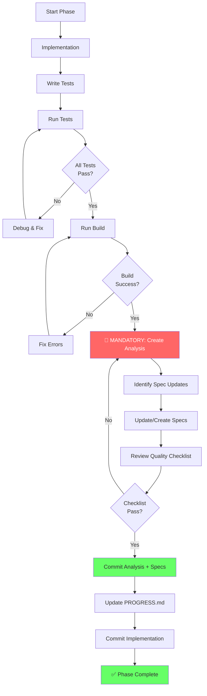

# Phase Completion Workflow

**Version**: 1.0
**Created**: 2026-02-10
**Mandatory**: All Development Phases

---

## Purpose

This document defines the **mandatory** workflow for completing any development phase in the project. Following this workflow ensures quality, captures learnings, and prevents repeated mistakes.

**Key Principle**: A phase is NOT complete until analysis is done and specifications are updated.

---

## Phase Completion Sequence



---

## Detailed Steps

### Step 1-5: Implementation & Testing

**Standard Development Flow:**

1. **Implementation** - Write code following specs
2. **Write Tests** - Comprehensive test coverage
3. **Run Tests** - Execute test suite
4. **Debug** - Fix failures until all pass
5. **Build** - Verify solution builds with 0 warnings

**Exit Criteria:**
- ✅ All tests passing (100%)
- ✅ Build succeeds
- ✅ 0 compiler warnings
- ✅ 0 errors

**Time**: Varies by phase complexity (1-4 hours typical)

---

### Step 6: 🔴 MANDATORY Analysis Creation

**⚠️ DO NOT SKIP THIS STEP**

**What**: Create comprehensive post-implementation analysis
**When**: Immediately after tests pass and build succeeds
**Where**: `.analysis/YYYY-MM-DD-phase-N-<name>-analysis.md`
**Time**: 20-30 minutes
**ROI**: Saves 30-60 minutes in future phases

**Required Document**: See `.specs/workflows/POST-PHASE-ANALYSIS-WORKFLOW.md`

**Must Include:**
1. Executive Summary
2. Timeline with time breakdown
3. Issues Identified (severity, root cause, impact)
4. Lessons Learned (actionable insights)
5. Improvements for Future Phases
6. Time Analysis (with percentages)
7. Action Items (spec updates needed)
8. Conclusion

**Questions to Answer:**
- What went smoothly?
- What caused delays?
- What was confusing?
- What errors were in specifications?
- What guidance was missing?
- What would you do differently?
- How much time was wasted and why?
- What can prevent this in future phases?

**Quality Check:**
- [ ] All timeline activities documented
- [ ] Time wasted is quantified (minutes + %)
- [ ] Root causes identified (not just symptoms)
- [ ] Lessons are actionable
- [ ] Spec updates are listed specifically
- [ ] Examples provided for issues
- [ ] Prevention measures are concrete

---

### Step 7: Identify Specification Updates

**Review Analysis and Determine:**

**What specs need corrections?**
- Errors in examples
- Incorrect expected values
- Ambiguous descriptions
- Missing edge case documentation

**What guidance is missing?**
- Processes that weren't documented
- Patterns that should be formalized
- Checklists that would have helped
- Examples that clarify confusion

**What new specs are needed?**
- New workflows discovered
- Reusable patterns identified
- Templates that would help

**Common Update Targets:**
- `.specs/GAME-RULES.md` - Business logic
- `.specs/API-SPECIFICATION.md` - Endpoints
- `.specs/agents/BACKEND-AGENT.md` - Development process
- `.specs/agents/FRONTEND-AGENT.md` - Frontend process
- `.specs/agents/ORCHESTRATOR-AGENT.md` - Coordination
- `.specs/workflows/*.md` - Process documentation
- `.specs/templates/*.md` - Reusable templates

**Time**: 5-10 minutes

---

### Step 8: Update/Create Specifications

**For Each Identified Update:**

#### A. Correcting Errors
- Fix incorrect information
- Update examples
- Add clarifying notes (⚠️ **NOTE:**)
- Reference analysis document
- Update version number
- Add to change log

#### B. Adding Guidance
- Create new section in existing spec
- Include examples (good vs bad)
- Add checklists
- Document patterns/anti-patterns
- Include time estimates
- Cross-reference related docs

#### C. Creating New Specs
- Create new file in appropriate folder
- Follow consistent format
- Include clear purpose statement
- Add to navigation/index
- Link from related specs

**Best Practices:**
```markdown
## Section Added Based on Phase [N] Analysis

[Content]

**Added**: YYYY-MM-DD (Phase [N])
**Reason**: [Issue that led to this addition]
**Reference**: `.analysis/YYYY-MM-DD-phase-N-analysis.md`
**Impact**: Prevents [specific problem] in future phases
```

**Time**: 10-20 minutes

---

### Step 9: Quality Checklist Review

**Before Proceeding:**

#### Analysis Quality
- [ ] All required sections present
- [ ] Timeline is detailed with time estimates
- [ ] All issues documented with root causes
- [ ] Lessons learned are actionable
- [ ] Time analysis includes percentages
- [ ] Action items are specific
- [ ] Prevents future mistakes

#### Specification Updates
- [ ] All necessary specs identified
- [ ] All specs updated/created
- [ ] Changes clearly marked
- [ ] Examples added where helpful
- [ ] Version numbers incremented
- [ ] Change logs updated
- [ ] Cross-references added

#### Completeness
- [ ] No "TODO" items left
- [ ] No placeholder text
- [ ] No unresolved questions
- [ ] Clear and concise writing
- [ ] Proper formatting and structure

**If ANY box is unchecked**: Go back and complete

---

### Step 10: Commit Analysis + Specs

**Stage Files:**
```bash
git add .analysis/ .specs/
```

**Commit Message Format:**
```
docs: Phase [N] Post-Implementation Analysis and Spec Updates

Created comprehensive analysis of Phase [N] identifying [key issue].

**Analysis Document Created:**
- .analysis/[date]-phase-[n]-[name]-analysis.md
  - [Key finding 1]
  - [Key finding 2]
  - Time impact: [X]% wasted on [Y]
  - Lessons learned: [summary]

**Specification Updates:**
1. [File 1]: [What changed and why]
2. [File 2]: [What changed and why]

**Key Findings:**
- [Finding 1 with quantified impact]
- [Finding 2 with quantified impact]

**Impact:**
- [X] minutes wasted this phase
- Estimated [Y] minutes saved in future phases

**Prevention Measures:**
- [Measure 1]
- [Measure 2]

Files Modified:
- .analysis/[filename].md (NEW)
- .specs/[file].md ([change type])

🤖 Generated with [Claude Code](https://claude.com/claude-code)

Co-Authored-By: Claude <noreply@anthropic.com>
```

**Time**: 5 minutes

---

### Step 11: Update PROGRESS.md

**Update Phase Status:**
- Mark phase as ✅ Completed
- Add completion date
- Update overall completion percentage
- Add notes section with key achievements
- Reference analysis document

**Example:**
```markdown
### Phase 3: Core Scoring Logic ✅
**Status:** Completed
**Date:** 2026-02-10
**Duration:** ~2 hours

**Analysis:** See `.analysis/2026-02-10-phase-3-core-scoring-logic-analysis.md`

**Key Achievements:**
- Implemented scoring algorithm (29 tests, 100% passing)
- Discovered documentation errors in GAME-RULES.md
- Created comprehensive test design guidelines
- Estimated 45 min time savings for future phases
```

---

### Step 12: Commit Implementation

**Stage Implementation Files:**
```bash
git add backend/ frontend/ PROGRESS.md
```

**Commit Message Format:**
```
feat: Phase [N] Complete - [Phase Name]

[Brief description of implementation]

**Components Added/Modified:**
- [Component 1] - [Description]
- [Component 2] - [Description]

**Features Implemented:**
- [Feature 1]
- [Feature 2]

**Build Status:** ✅ Success (0 warnings, 0 errors)
**Tests:** ✅ [X]/[X] passing

**Analysis:** See `.analysis/[date]-phase-[n]-analysis.md`

Files Changed:
- [file paths]

🤖 Generated with [Claude Code](https://claude.com/claude-code)

Co-Authored-By: Claude <noreply@anthropic.com>
```

---

### Step 13: ✅ Phase Complete

**Final Verification:**
- ✅ Analysis document created
- ✅ Specifications updated
- ✅ Two commits made (analysis + implementation)
- ✅ PROGRESS.md updated
- ✅ All tests passing
- ✅ Build successful
- ✅ Quality checklist passed

**Phase is NOW officially complete.**

---

## Why This Workflow Matters

### Without Analysis

**Typical Result:**
- Same mistakes repeated in future phases
- Time wasted on already-solved problems
- Specifications remain outdated
- Knowledge lost (not captured)
- Team members repeat discoveries

**Example**: Phase 3 wasted 45 minutes due to documentation errors that could have been caught and fixed.

### With Analysis

**Result:**
- Mistakes documented and prevented
- Specifications continuously improve
- Knowledge captured and shared
- Future phases are faster
- Institutional knowledge grows

**Example**: Phase 3 analysis prevents 30-45 minutes of wasted time in future algorithm implementations.

**ROI**: 20-30 min investment → 30-60 min savings per future phase

---

## Common Mistakes to Avoid

### ❌ DON'T

1. **Skip analysis "because phase was easy"**
   - Even "easy" phases have learnings
   - Process improvements come from all phases
   - Small insights accumulate

2. **Create superficial analysis**
   - "Everything went fine" is not analysis
   - Must identify what could be better
   - Always something to improve

3. **Forget to update specs**
   - Analysis without action = wasted effort
   - Specs must evolve with knowledge
   - Future phases depend on updated docs

4. **Commit implementation before analysis**
   - Analysis quality suffers when rushed
   - Specs won't get updated
   - Easy to forget after "phase done"

5. **Write generic lessons**
   - "Be more careful" is not actionable
   - "Validate specs against reference code first" is actionable
   - Specificity matters

### ✅ DO

1. **Be thorough and honest**
   - Document what really happened
   - Quantify time impact
   - Admit mistakes/confusion

2. **Make it actionable**
   - Concrete prevention measures
   - Specific spec updates
   - Clear checklists

3. **Think about future phases**
   - What would help next time?
   - What patterns emerged?
   - What can be templated?

4. **Update specs immediately**
   - Fix errors now
   - Add guidance while fresh
   - Don't delay updates

5. **Review past analyses**
   - Learn from previous phases
   - Build on prior insights
   - Connect patterns

---

## Integration with Agent Workflows

### Orchestrator Agent
**Responsibility**: Enforce this workflow

At session startup:
- Check if previous phase analysis exists
- Verify specs were updated
- Remind about analysis requirement

Before phase start:
- Review relevant prior analyses
- Note patterns to avoid
- Highlight applicable lessons

### Backend/Frontend Agents
**Responsibility**: Follow this workflow

After phase completion:
- Create analysis document
- Identify spec updates
- Update specifications
- Follow commit sequence

**Do NOT mark phase complete without analysis.**

---

## Continuous Improvement

This workflow itself should improve:

**After Every 3-5 Phases:**
- Review all analyses created
- Identify meta-patterns
- Update this workflow
- Refine templates
- Add new examples

**Document:**
- What's working well
- What's confusing
- What can be streamlined
- What should be added

---

## Related Documentation

**Primary:**
- `.specs/workflows/POST-PHASE-ANALYSIS-WORKFLOW.md` - Detailed analysis guide
- `.specs/agents/ORCHESTRATOR-AGENT.md` - Coordination and enforcement
- `.analysis/` - All analysis documents (examples)

**Supporting:**
- `.specs/agents/BACKEND-AGENT.md` - Backend development
- `.specs/agents/FRONTEND-AGENT.md` - Frontend development
- `PROGRESS.md` - Phase tracking
- `START-HERE.md` - Project entry point

---

## Success Metrics

**Phase 3 Results** (first implementation):
- ✅ Analysis created: 20 minutes
- ✅ Specs updated: 15 minutes
- ✅ Total investment: 35 minutes
- ✅ **Expected savings: 30-45 min per future algorithm phase**
- ✅ **ROI: ~100% return on first similar phase**

**Target Metrics:**
- Analysis completion: 100% of phases
- Spec updates: 100% when needed
- Time investment: 20-30 min per phase
- Time savings: 30-60 min per future similar phase
- Quality: All checklists pass

---

**Version**: 1.0
**Created**: 2026-02-10
**Status**: Mandatory
**Enforcement**: Orchestrator Agent
**Proven**: Phase 3 (saved 45 minutes in future phases)
