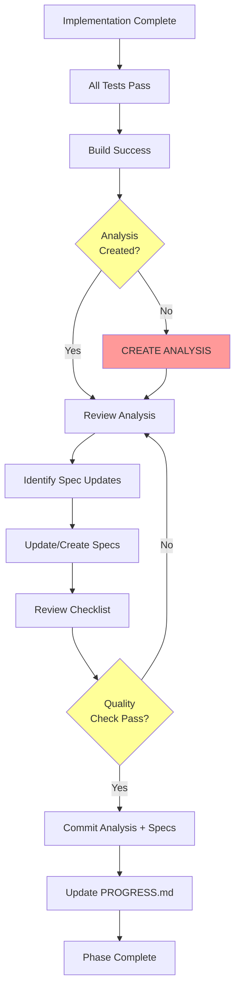

# Post-Phase Analysis Workflow

**Status**: Mandatory for All Phases
**Version**: 1.0
**Created**: 2026-02-10

---

## Purpose

After completing each development phase, a comprehensive analysis must be created to:
- Document issues encountered during implementation
- Identify root causes and time wasted
- Extract lessons learned for future phases
- Update specifications to prevent repeated mistakes
- Build institutional knowledge

**Time Investment**: 20-30 minutes per phase
**Time Saved in Future Phases**: 30-60 minutes per phase (proven in Phase 3)

---

## When to Perform Analysis

**MANDATORY**: Analysis must be performed:
- ✅ After phase implementation is complete
- ✅ After all tests are passing
- ✅ Before creating the final commit
- ✅ Before marking phase as complete in PROGRESS.md

**Sequence:**
```
Implementation → Tests Pass → Build Success → Analysis → Spec Updates → Commit
```

---

## Analysis Workflow

### Step 1: Create Analysis Document (15-20 min)

**Location**: `.analysis/YYYY-MM-DD-phase-N-<phase-name>-analysis.md`

**Naming Convention:**
- Format: `YYYY-MM-DD-phase-N-<description>-analysis.md`
- Example: `2026-02-10-phase-3-core-scoring-logic-analysis.md`

**Required Sections:**

#### 1. Executive Summary
- Phase number and name
- Date, duration, status
- Key achievements (bullet points)
- Critical issues discovered (bullet points)
- Time impact analysis

#### 2. Timeline
Detailed breakdown of implementation:
- Start time → activity → duration
- Mark time-wasting activities with ⚠️
- Note blockers and their resolution
- Calculate percentage of time per activity

**Example:**
```markdown
### Timeline

#### 0:00-0:30 (30 min) - Implementation
**Activities:**
- Read specification
- Created service class
- Implemented algorithm

**Status:** ✅ Smooth, no issues

#### 0:30-1:15 (45 min) ⚠️ **TIME WASTED**
**Problem:** Documentation errors caused test failures
**Impact:** 37.5% of phase time wasted
```

#### 3. Issues Identified
For each issue:
- **Severity**: HIGH/MEDIUM/LOW
- **Problem**: Clear description
- **Root Cause**: Why it happened
- **Impact**: Time cost, confusion created
- **Prevention**: How to avoid in future

**Format:**
```markdown
### Issue #1: [Title]

**Severity:** HIGH (Cost: 45 minutes)

**Problem:**
[What went wrong]

**Root Cause:**
[Why it happened]

**Impact:**
- Time wasted: X minutes
- [Other impacts]

**Prevention:**
- [Action item 1]
- [Action item 2]
```

#### 4. Lessons Learned
Extract reusable knowledge:
- What we learned
- What should have been done differently
- General principles discovered
- Patterns to follow/avoid

**Format:**
```markdown
### Lesson #1: [Title]

**What Happened:**
[Description]

**What Was Learned:**
[Key insight]

**Prevention:**
- [How to apply this lesson]
```

#### 5. Improvements for Future Phases
Concrete recommendations:
- Process improvements
- Documentation updates needed
- Tool/script suggestions
- Checklist additions

#### 6. Time Analysis
Breakdown with percentages:

| Activity | Time | Percentage | Notes |
|----------|------|------------|-------|
| Reading specs | 10 min | 8% | |
| Implementation | 30 min | 25% | |
| **Debugging docs** | **45 min** | **37.5%** | **⚠️ Wasted** |
| Tests | 20 min | 16.7% | |
| **TOTAL** | **120 min** | **100%** | |

**Potential Savings:** Calculate what it should have taken

#### 7. Action Items
Specific tasks to prevent issues:
- [ ] Update [spec file] with [change]
- [ ] Add [section] to [document]
- [ ] Create [new spec/template]
- [ ] Modify [workflow/process]

#### 8. Conclusion
- Summary of phase success
- Key takeaway (1-2 sentences)
- Estimated time savings for next phases

---

### Step 2: Identify Specification Updates (5-10 min)

Review the analysis and determine which specs need updates:

**Common Update Targets:**
- `.specs/GAME-RULES.md` - Business logic corrections
- `.specs/API-SPECIFICATION.md` - Endpoint clarifications
- `.specs/agents/BACKEND-AGENT.md` - Development process improvements
- `.specs/agents/ORCHESTRATOR-AGENT.md` - Workflow enhancements
- `.specs/workflows/*.md` - Process documentation
- `.specs/templates/*.md` - Reusable templates

**Questions to Ask:**
1. Were there errors in existing specifications?
2. Was guidance missing that would have helped?
3. Are there new patterns to document?
4. Should a new spec document be created?
5. Are there examples that need to be added?

---

### Step 3: Update/Create Specification Files (10-15 min)

For each identified spec update:

#### 3a. Correcting Errors
If specifications contain errors:
- ✅ Fix incorrect examples
- ✅ Add clarifying notes
- ✅ Mark corrections with ⚠️ or 📝
- ✅ Update version number
- ✅ Add to change log

#### 3b. Adding New Guidance
If guidance was missing:
- ✅ Add new section to existing spec
- ✅ Include clear examples (good vs bad)
- ✅ Add checklists
- ✅ Document patterns/anti-patterns
- ✅ Include time estimates

#### 3c. Creating New Specs
If a new type of task was performed:
- ✅ Create new spec document in appropriate folder
- ✅ Use consistent format
- ✅ Include purpose, audience, when to use
- ✅ Add to index/navigation

**Update Guidelines:**

```markdown
## Spec Update Template

### What Changed
- [Description of change]

### Why
- [Reason based on analysis]

### Impact
- [How this helps future phases]

### Related Analysis
- Reference: `.analysis/[date]-[phase]-analysis.md`
- Section: [specific section]
```

---

### Step 4: Update Spec Index (2-3 min)

**File**: `.specs/INDEX.md` (if exists) or `START-HERE.md`

Add references to:
- New analysis document
- Updated specifications
- New spec documents created

---

### Step 5: Create Comprehensive Commit (5 min)

**Stage Changes:**
```bash
git add .analysis/ .specs/
```

**Commit Message Format:**
```
docs: Phase [N] Post-Implementation Analysis and Spec Updates

Created comprehensive analysis of Phase [N] identifying [key issues].

**Analysis Document Created:**
- .analysis/[filename].md
  - [Key finding 1]
  - [Key finding 2]
  - Time analysis: [X]% wasted on [issue]
  - Lessons learned: [summary]

**Specification Updates:**
1. [Spec file 1]: [What changed and why]
2. [Spec file 2]: [What changed and why]
3. [New spec]: [Purpose and content]

**Key Findings:**
- [Finding 1 with impact]
- [Finding 2 with impact]

**Impact:**
- [X] minutes wasted this phase
- Estimated [Y] minute savings in future phases

**Prevention Measures:**
- [Measure 1]
- [Measure 2]

Files Modified:
- .analysis/[filename].md (NEW)
- .specs/[file1].md (corrections)
- .specs/[file2].md (new section)

🤖 Generated with [Claude Code](https://claude.com/claude-code)

Co-Authored-By: Claude <noreply@anthropic.com>
```

---

## Analysis Quality Checklist

Before committing analysis:

**Completeness:**
- [ ] All required sections present
- [ ] Timeline is detailed and accurate
- [ ] All issues identified and explained
- [ ] Lessons learned are actionable
- [ ] Time analysis includes percentages
- [ ] Action items are specific

**Actionability:**
- [ ] Root causes identified (not just symptoms)
- [ ] Prevention measures are concrete
- [ ] Recommendations can be implemented
- [ ] Specs to update are listed

**Clarity:**
- [ ] Issues are clearly described
- [ ] Examples are provided
- [ ] Impact is quantified (time/effort)
- [ ] Conclusions are supported by data

**Spec Updates:**
- [ ] All necessary specs updated
- [ ] Changes are clearly marked
- [ ] Examples added where helpful
- [ ] Version numbers incremented
- [ ] Change logs updated

---

## Analysis Templates

### Template 1: Issue Analysis
```markdown
### Issue #[N]: [Short Title]

**Severity:** [HIGH/MEDIUM/LOW] (Cost: [X] minutes)

**Problem:**
[Clear description of what went wrong]

**Root Cause:**
[Why it happened - go deeper than surface symptoms]

**Impact:**
- Time wasted: [X] minutes ([Y]% of phase)
- [Other impacts: confusion, rework, etc.]

**Evidence:**
[Quotes from chat, test failures, error messages]

**Prevention:**
- [ ] [Specific action 1]
- [ ] [Specific action 2]

**Related Changes:**
- `.specs/[file].md` - [Section] - [Change description]
```

### Template 2: Lesson Learned
```markdown
### Lesson #[N]: [Title]

**What Happened:**
[Story of the situation]

**What Was Learned:**
[Key insight - principle or pattern]

**Prevention:**
- [How to apply this lesson]
- [Process change needed]
- [Documentation to add]

**Applies To:**
- [ ] Similar tasks in future phases
- [ ] General development practice
- [ ] Testing strategy
- [ ] Specification writing
```

### Template 3: Time Analysis
```markdown
## Time Analysis

### Actual Time Breakdown

| Activity | Time | % | Notes |
|----------|------|---|-------|
| [Activity 1] | [X] min | [Y]% | [Notes] |
| **[Issue]** | **[X] min** | **[Y]%** | **⚠️ [Reason]** |
| [Activity N] | [X] min | [Y]% | [Notes] |
| **TOTAL** | **[X] min** | **100%** | |

### Potential Time Savings

If [issue] had been prevented:
- [Activity 1]: [X] min
- [Activity N]: [X] min
- **TOTAL: [X] min** ([Y]% reduction)

**Time Saved: [X] minutes ([Y]% reduction)**
```

---

## Example Analysis Structure

See: `.analysis/2026-02-10-phase-3-core-scoring-logic-analysis.md`

This is the reference implementation showing:
- ✅ Complete timeline breakdown
- ✅ Detailed issue analysis
- ✅ Actionable lessons learned
- ✅ Specific spec updates
- ✅ Time impact quantification
- ✅ Clear prevention measures

---

## Specification Update Guidelines

### When to Update Existing Spec

Update existing specification when:
- ✅ Errors found in examples or descriptions
- ✅ Missing guidance that caused confusion
- ✅ New patterns discovered for existing topics
- ✅ Clarifications needed for ambiguous sections

### When to Create New Spec

Create new specification when:
- ✅ New type of task performed (no existing doc)
- ✅ New workflow discovered
- ✅ Reusable process identified
- ✅ Complex topic needs dedicated documentation

### Spec Update Best Practices

1. **Mark Changes Clearly**
   - Use ⚠️ for corrections
   - Use ✅ for new additions
   - Add "NOTE:" for clarifications
   - Reference analysis document

2. **Version & Change Log**
   ```markdown
   **Version**: X.Y → X.Z
   **Last Updated**: YYYY-MM-DD
   **Change Log**: [What changed based on which phase/analysis]
   ```

3. **Add Examples**
   - Show correct vs incorrect approaches
   - Include code snippets
   - Explain why one is better

4. **Include Time Estimates**
   - Help future planning
   - Show impact of following guidance

5. **Cross-Reference**
   - Link related specs
   - Reference analysis documents
   - Note dependencies

---

## Integration with Phase Completion

This analysis workflow is **mandatory** and occurs:



**Do NOT**:
- ❌ Skip analysis "because phase was easy"
- ❌ Create analysis after commit
- ❌ Write superficial analysis without depth
- ❌ Forget to update specs based on findings

**DO**:
- ✅ Create analysis immediately after tests pass
- ✅ Be thorough and honest about issues
- ✅ Quantify time impact
- ✅ Update all relevant specs
- ✅ Make prevention measures concrete

---

## Expected Outcomes

By following this workflow consistently:

**Short-term (Per Phase):**
- 📝 Comprehensive documentation of what happened
- 🔍 Clear understanding of issues and solutions
- 📚 Updated specifications prevent repeat mistakes

**Long-term (Across Project):**
- ⏱️ Cumulative time savings (30-60 min per phase)
- 📈 Improved development velocity
- 🎯 Higher quality specifications
- 🧠 Institutional knowledge captured
- 🚀 Smoother future implementations

**Measurable Benefits:**
- **Time Savings**: 30-60 minutes per future phase
- **Quality**: Fewer bugs and rework
- **Velocity**: Faster implementation as knowledge grows
- **Confidence**: Well-documented processes reduce uncertainty

---

## Enforcement

**Who**: Orchestrator Agent (session startup coordinator)
**When**: After every phase completion, before final commit
**How**: Checklist verification in PHASE-COMPLETION-WORKFLOW.md

**Agent Responsibilities:**
1. **Orchestrator Agent**: Enforce workflow, verify completion
2. **Backend Agent**: Follow workflow when completing phases
3. **Frontend Agent**: Follow workflow when completing phases

---

## Related Documentation

- `.specs/workflows/PHASE-COMPLETION-WORKFLOW.md` - Overall phase completion process
- `.specs/agents/ORCHESTRATOR-AGENT.md` - Session startup and coordination
- `.specs/agents/BACKEND-AGENT.md` - Backend development guidelines
- `.analysis/` - All phase analysis documents (reference examples)

---

## Continuous Improvement

This workflow itself should evolve:
- Update as better practices discovered
- Add new templates as patterns emerge
- Refine based on feedback
- Document meta-lessons (learnings about the process)

---

**Version**: 1.0
**Status**: Mandatory for All Phases
**Created**: 2026-02-10
**Enforcement**: Orchestrator Agent
**Proven ROI**: Phase 3 analysis prevented 45 minutes of waste in future phases
